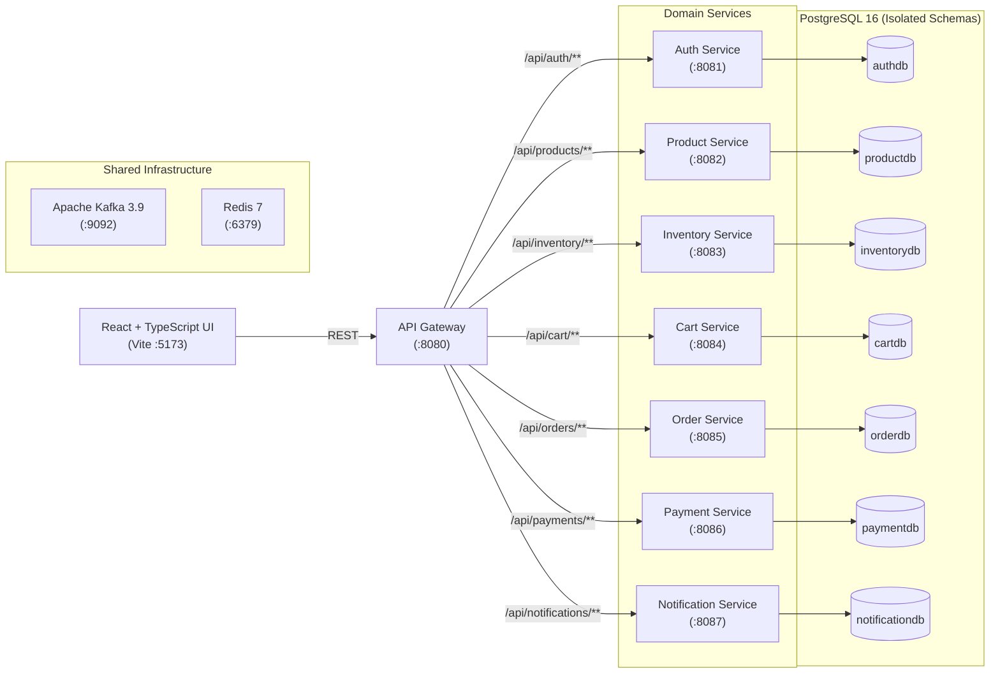

# MarketHub

A multi-vendor e-commerce platform built as a distributed system with Spring Boot microservices, Spring Cloud Gateway, and a React/TypeScript storefront. It handles vendor catalog management, unified customer carts, optimistic concurrency control for stock reservations, and idempotent payment processing with database-per-service isolation.


---

## Architecture

Client requests enter through a Spring Cloud API Gateway, which handles routing and CORS before forwarding requests to independent domain services. Each transactional service owns an isolated PostgreSQL database schema.



---

## Tech Stack

| Category | Technology | Purpose in this project |
| :--- | :--- | :--- |
| **Backend Framework** | Spring Boot 3.4.5, Java 17 | Core runtime and REST APIs for all microservices |
| **Gateway** | Spring Cloud Gateway 2024.0.2 | Single ingress point, route predicates, CORS handling |
| **Database** | PostgreSQL 16 (Alpine) | Isolated database per service (`authdb`, `orderdb`, etc.) |
| **Migrations** | Flyway | Versioned schema migrations (`V1__init.sql`) and catalog seed data (`V2__seed.sql`) |
| **ORM & Concurrency** | Spring Data JPA / Hibernate | Data access, relationship modeling, and optimistic locking (`@Version`) |
| **Security** | Spring Security, JJWT 0.12.6, BCrypt | Password hashing and stateless HMAC-SHA JWT access tokens |
| **Messaging & Cache** | Apache Kafka 3.9 (KRaft), Redis 7 | Event bus for asynchronous domain events and cache layer |
| **Frontend** | React 18.3.1, TypeScript 5.7.2, Vite 6.0.7 | Customer storefront SPA with real-time stock and checkout flow |
| **HTTP Client** | Axios 1.7.9 | Gateway API communication with centralized base URL configuration |
| **CI** | GitHub Actions | Automated build verification for backend (`mvn verify`) and frontend (`npm run build`) |

---

## Key Engineering Decisions

* **Optimistic locking for stock reservations** ([`Inventory.java`](file:///backend/inventory-service/src/main/java/com/ecommerce/inventory/service/Inventory.java), [`InventoryController.java`](file:///backend/inventory-service/src/main/java/com/ecommerce/inventory/service/InventoryController.java))  
  Uses JPA `@Version` on the inventory table. When multiple checkouts race for the last remaining units of a SKU, concurrent conflicting updates fail fast with an `OptimisticLockException` rather than holding row-level database locks that degrade throughput.

* **Idempotent payment capture** ([`Payment.java`](file:///backend/payment-service/src/main/java/com/ecommerce/payment/service/Payment.java), [`PaymentController.java`](file:///backend/payment-service/src/main/java/com/ecommerce/payment/service/PaymentController.java))  
  Enforces a unique database constraint on `idempotency_key`. The controller looks up existing transactions before processing, guaranteeing that client retries or transient connection drops never double-charge an order.

* **Database-per-service isolation** ([`init-databases.sql`](file:///infra/init-databases.sql), service `application.yml` configs)  
  Each service connects to its own independent database (`authdb`, `productdb`, `orderdb`, etc.). This enforces loose coupling, prevents cross-boundary SQL joins, and allows each domain schema to migrate independently via Flyway.

* **Fixed-precision arithmetic for currency** ([`Product.java`](file:///backend/product-service/src/main/java/com/ecommerce/product/service/Product.java), [`CartItem.java`](file:///backend/cart-service/src/main/java/com/ecommerce/cart/service/CartItem.java), [`Order.java`](file:///backend/order-service/src/main/java/com/ecommerce/order/service/Order.java), [`Payment.java`](file:///backend/payment-service/src/main/java/com/ecommerce/payment/service/Payment.java))  
  All monetary fields use `BigDecimal` mapped to PostgreSQL `numeric(14,2)`. This avoids binary floating-point rounding inaccuracies common with IEEE 754 `float`/`double` types during cart subtotal and tax calculations.

* **Composite unique constraint on cart items** ([`CartItem.java`](file:///backend/cart-service/src/main/java/com/ecommerce/cart/service/CartItem.java), [`CartController.java`](file:///backend/cart-service/src/main/java/com/ecommerce/cart/service/CartController.java))  
  A composite unique constraint on `(customer_id, product_id)` prevents race conditions from inserting duplicate rows for the same product, aggregating quantities atomically on repeat "Add to Cart" requests.

---

## API Documentation

### Service Endpoints & Health Checks

Each service exposes Spring Boot Actuator health endpoints. When running with OpenAPI / Swagger UI dependencies (`springdoc-openapi-starter-webmvc-ui`), documentation is available at the paths below:

| Service | Port | Base Path | Actuator Health | Swagger UI |
| :--- | :--- | :--- | :--- | :--- |
| **API Gateway** | `8080` | `/` | `http://localhost:8080/actuator/health` | Gateway routed |
| **Auth Service** | `8081` | `/api/auth` | `http://localhost:8081/actuator/health` | `http://localhost:8081/swagger-ui.html` |
| **Product Service** | `8082` | `/api/products` | `http://localhost:8082/actuator/health` | `http://localhost:8082/swagger-ui.html` |
| **Inventory Service** | `8083` | `/api/inventory` | `http://localhost:8083/actuator/health` | `http://localhost:8083/swagger-ui.html` |
| **Cart Service** | `8084` | `/api/cart` | `http://localhost:8084/actuator/health` | `http://localhost:8084/swagger-ui.html` |
| **Order Service** | `8085` | `/api/orders` | `http://localhost:8085/actuator/health` | `http://localhost:8085/swagger-ui.html` |
| **Payment Service** | `8086` | `/api/payments` | `http://localhost:8086/actuator/health` | `http://localhost:8086/swagger-ui.html` |
| **Notification Service** | `8087` | `/api/notifications` | `http://localhost:8087/actuator/health` | `http://localhost:8087/swagger-ui.html` |

### Core Endpoints

| Method | Path | Controller | Purpose |
| :--- | :--- | :--- | :--- |
| `POST` | `/api/auth/register` | [`AuthController`](file:///backend/auth-service/src/main/java/com/ecommerce/auth/service/AuthController.java) | Creates a user account with BCrypt password hash and assigns role |
| `POST` | `/api/auth/login` | [`AuthController`](file:///backend/auth-service/src/main/java/com/ecommerce/auth/service/AuthController.java) | Authenticates credentials and returns a signed JWT Bearer token |
| `GET` | `/api/products` | [`ProductController`](file:///backend/product-service/src/main/java/com/ecommerce/product/service/ProductController.java) | Paginated list of active products with search query parameter `q` |
| `POST` | `/api/inventory/{productId}/reserve` | [`InventoryController`](file:///backend/inventory-service/src/main/java/com/ecommerce/inventory/service/InventoryController.java) | Decrements available stock under `@Version` optimistic locking check |
| `POST` | `/api/cart/items` | [`CartController`](file:///backend/cart-service/src/main/java/com/ecommerce/cart/service/CartController.java) | Adds or increments product quantity for a customer's cart |
| `POST` | `/api/orders` | [`OrderController`](file:///backend/order-service/src/main/java/com/ecommerce/order/service/OrderController.java) | Creates an order record with status `PENDING_PAYMENT` |
| `POST` | `/api/payments` | [`PaymentController`](file:///backend/payment-service/src/main/java/com/ecommerce/payment/service/PaymentController.java) | Captures payment idempotently using an `idempotencyKey` |

---

## Getting Started

### Prerequisites
* Java 17 (JDK)
* Maven 3.9+
* Node.js 20+ & npm 10+
* Docker & Docker Compose

### Environment Variables
Environment overrides can be set via `.env` (reference in [`.env.example`](file:///.env.example)):

```bash
JWT_SECRET=replace-with-a-strong-64-byte-secret
DB_USER=ecommerce
DB_PASSWORD=ecommerce
DB_HOST=localhost
VITE_API_URL=http://localhost:8080
```

### 1. Start Infrastructure
Start PostgreSQL, Redis, and Kafka in the background:

```bash
docker compose -f infra/docker-compose.yml up -d
```
*PostgreSQL automatically creates all 7 databases (`authdb`, `productdb`, etc.) on first launch via `infra/init-databases.sql`.*

### 2. Build Backend
Compile and package all Maven modules:

```bash
cd backend
mvn clean verify
cd ..
```

### 3. Run Backend Services
Launch the Gateway and services (in separate terminals or via your IDE):

```bash
# In separate terminals:
mvn -pl backend/api-gateway spring-boot:run
mvn -pl backend/auth-service spring-boot:run
mvn -pl backend/product-service spring-boot:run
mvn -pl backend/inventory-service spring-boot:run
mvn -pl backend/cart-service spring-boot:run
mvn -pl backend/order-service spring-boot:run
mvn -pl backend/payment-service spring-boot:run
mvn -pl backend/notification-service spring-boot:run
```
*Flyway runs migrations automatically on service startup, populating initial product and inventory seed data.*

### 4. Run Frontend
```bash
cd frontend
npm install
npm run dev
```
Storefront opens at: `http://localhost:5173`

### 5. Verification
Confirm services are healthy through the API Gateway:

```bash
# Check gateway health
curl http://localhost:8080/actuator/health

# Fetch catalog products through gateway
curl http://localhost:8080/api/products
```

---

## Project Structure

```text
multivendor-ecommerce-final/
├── backend/
│   ├── pom.xml                 # Parent Maven POM (Spring Boot 3.4.5, Spring Cloud 2024.0.2)
│   ├── common/                 # Shared utilities (JwtUtil, ApiError, EventEnvelope)
│   ├── api-gateway/            # Spring Cloud Gateway (:8080) for routing and CORS
│   ├── auth-service/           # User registration, login, BCrypt hashing, JWT issuance (:8081)
│   ├── product-service/        # Multi-vendor catalog, categories, search pagination (:8082)
│   ├── inventory-service/      # Inventory tracking with optimistic locking reservations (:8083)
│   ├── cart-service/           # Cart persistence and line-item aggregation (:8084)
│   ├── order-service/          # Order state machine (PENDING, PAID, etc.) (:8085)
│   ├── payment-service/        # Idempotent payment capture and records (:8086)
│   └── notification-service/   # User notifications and alerts (:8087)
├── frontend/                   # React 18, TypeScript, Vite storefront SPA (:5173)
├── infra/                      # Docker Compose (PostgreSQL 16, Redis 7, Kafka 3.9) & init SQL
├── docs/                       # Architecture, DB schema, and event specs
└── .github/workflows/          # GitHub Actions CI for backend and frontend builds
```

---

## Testing

Run build and packaging verification:

```bash
# Backend compilation, dependency verification, and packaging
cd backend && mvn clean verify

# Frontend TypeScript type checking and Vite production bundle
cd frontend && npm run build
```

**Coverage notes:**
* Automated unit/integration test suites (`src/test`) are not currently implemented.
* The GitHub Actions CI pipeline enforces build and package integrity via `mvn clean verify` on Java 17 and `tsc -b && vite build` on Node 20 on every push and PR.

---

## Live Demo

Deployed at: [URL] (may be stopped outside active demo windows — see note below)

*Note: This is a portfolio deployment, not production-configured (no auto-scaling/monitoring).*
