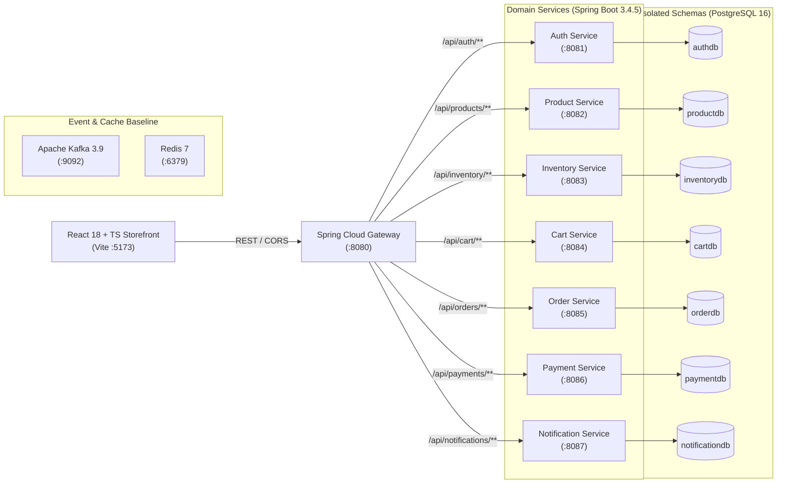

# MarketHub — Multi-Vendor E-Commerce Platform

A distributed, multi-vendor e-commerce platform that enables independent merchants to catalog and manage merchandise while providing consumers with unified shopping carts, optimistic concurrency-controlled inventory reservations, and idempotent payment processing.


---

## Architecture Overview

MarketHub follows a decoupled microservices architecture. Client requests flow through an API Gateway to autonomous domain services, each maintaining an isolated PostgreSQL database schema.



---

## Tech Stack

| Category | Technology | Purpose in This Project |
| :--- | :--- | :--- |
| **Language & Runtime** | Java 17 | Core backend runtime for all microservices |
| **Backend Framework** | Spring Boot 3.4.5 | Service foundation, REST controllers, and dependency injection |
| **API Gateway** | Spring Cloud Gateway 2024.0.2 | Unified entry point, request routing, CORS configuration, and Actuator metrics |
| **Persistence & ORM** | Spring Data JPA / Hibernate | Object-relational mapping, transactional management, and optimistic locking |
| **Database** | PostgreSQL 16 (Alpine) | Isolated relational persistence per microservice |
| **Schema Migrations** | Flyway Core & Flyway-PostgreSQL | Version-controlled DDL migrations (`V1__init.sql`) and catalog/inventory seeding (`V2__seed.sql`) |
| **Authentication & Security** | Spring Security & JJWT 0.12.6 | BCrypt password hashing and HMAC-SHA JWT access token generation |
| **Message Broker** | Apache Kafka 3.9 (Bitnami KRaft) | Event stream infrastructure for asynchronous domain events (`ecommerce.<domain>.v1`) |
| **Cache Store** | Redis 7 (Alpine) | In-memory cache infrastructure |
| **Frontend Framework** | React 18.3.1 & TypeScript 5.7.2 | Type-safe single-page application and interactive customer storefront |
| **Build & Tooling** | Vite 6.0.7 / Maven 3.9+ | Fast frontend HMR/bundling and multi-module backend lifecycle management |
| **HTTP Client** | Axios 1.7.9 | API Gateway communication with configurable `VITE_API_URL` |
| **CI / CD** | GitHub Actions | Automated build verification for backend (`mvn verify`) and frontend (`npm run build`) |

---

## Key Engineering Decisions

* **Optimistic Locking on Stock Allocation**  
  *Implementation:* [`Inventory.java`](file:///backend/inventory-service/src/main/java/com/ecommerce/inventory/service/Inventory.java) (`@Version private long version;`) & [`InventoryController.java`](file:///backend/inventory-service/src/main/java/com/ecommerce/inventory/service/InventoryController.java)  
  *Why this matters:* Eliminates overselling under concurrent checkouts without acquiring pessimistic database row locks, allowing failed conflicting transactions to abort cleanly via `OptimisticLockException`.

* **Idempotency-Key Enforced Payment Capture**  
  *Implementation:* [`Payment.java`](file:///backend/payment-service/src/main/java/com/ecommerce/payment/service/Payment.java) (`@UniqueConstraint(columnNames="idempotency_key")`) & [`PaymentController.java`](file:///backend/payment-service/src/main/java/com/ecommerce/payment/service/PaymentController.java)  
  *Why this matters:* Guarantees that network retries or accidental double-submissions from the client never create duplicate financial transactions.

* **Database-Per-Service Schema Isolation**  
  *Implementation:* [`init-databases.sql`](file:///infra/init-databases.sql) & individual service `application.yml` files (`authdb`, `productdb`, `inventorydb`, `cartdb`, `orderdb`, `paymentdb`, `notificationdb`)  
  *Why this matters:* Prevents distributed monolith coupling by barring cross-service SQL joins and ensuring domain data can evolve independently through isolated Flyway migration lifecycles.

* **Fixed-Precision Financial Arithmetic (`BigDecimal`)**  
  *Implementation:* [`Product.java`](file:///backend/product-service/src/main/java/com/ecommerce/product/service/Product.java), [`CartItem.java`](file:///backend/cart-service/src/main/java/com/ecommerce/cart/service/CartItem.java), [`Order.java`](file:///backend/order-service/src/main/java/com/ecommerce/order/service/Order.java), and [`Payment.java`](file:///backend/payment-service/src/main/java/com/ecommerce/payment/service/Payment.java) (`numeric(14,2)`)  
  *Why this matters:* Prevents binary floating-point round-off errors inherent to IEEE 754 `float`/`double` types across pricing, cart summaries, and payment transactions.

* **Composite Persistence Constraint for Cart Aggregation**  
  *Implementation:* [`CartItem.java`](file:///backend/cart-service/src/main/java/com/ecommerce/cart/service/CartItem.java) (`@UniqueConstraint(name="uk_cart_product", columnNames={"customer_id","product_id"})`) & [`CartController.java`](file:///backend/cart-service/src/main/java/com/ecommerce/cart/service/CartController.java)  
  *Why this matters:* Enforces single-row-per-product uniqueness per customer at the database level, preventing race conditions from creating duplicate cart line items.

---

## API Documentation

### Service Endpoints & Health Check URLs

Each microservice exposes Spring Boot Actuator health and metrics endpoints. OpenAPI / Swagger UI dependencies can be attached directly via `springdoc-openapi-starter-webmvc-ui` at `/swagger-ui.html`.

| Service | Port | Base Path | Actuator Health URL | Swagger / OpenAPI Path |
| :--- | :--- | :--- | :--- | :--- |
| **API Gateway** | `8080` | `/` | `http://localhost:8080/actuator/health` | Routed via gateway |
| **Auth Service** | `8081` | `/api/auth` | `http://localhost:8081/actuator/health` | `http://localhost:8081/swagger-ui.html` |
| **Product Service** | `8082` | `/api/products` | `http://localhost:8082/actuator/health` | `http://localhost:8082/swagger-ui.html` |
| **Inventory Service** | `8083` | `/api/inventory` | `http://localhost:8083/actuator/health` | `http://localhost:8083/swagger-ui.html` |
| **Cart Service** | `8084` | `/api/cart` | `http://localhost:8084/actuator/health` | `http://localhost:8084/swagger-ui.html` |
| **Order Service** | `8085` | `/api/orders` | `http://localhost:8085/actuator/health` | `http://localhost:8085/swagger-ui.html` |
| **Payment Service** | `8086` | `/api/payments` | `http://localhost:8086/actuator/health` | `http://localhost:8086/swagger-ui.html` |
| **Notification Service** | `8087` | `/api/notifications` | `http://localhost:8087/actuator/health` | `http://localhost:8087/swagger-ui.html` |

### Core API Endpoints

| Method | Route | Controller | Description |
| :--- | :--- | :--- | :--- |
| `POST` | `/api/auth/register` | [`AuthController`](file:///backend/auth-service/src/main/java/com/ecommerce/auth/service/AuthController.java) | Creates user with BCrypt-hashed password and returns user ID and role (`CUSTOMER`). |
| `POST` | `/api/auth/login` | [`AuthController`](file:///backend/auth-service/src/main/java/com/ecommerce/auth/service/AuthController.java) | Validates credentials and returns signed HMAC-SHA JWT Bearer token valid for 3600 seconds. |
| `GET` | `/api/products` | [`ProductController`](file:///backend/product-service/src/main/java/com/ecommerce/product/service/ProductController.java) | Returns paginated list of active products (`Page<Product>`) with optional name query filter `q`. |
| `POST` | `/api/inventory/{productId}/reserve` | [`InventoryController`](file:///backend/inventory-service/src/main/java/com/ecommerce/inventory/service/InventoryController.java) | Atomically decrements available inventory for a product under `@Version` optimistic locking. |
| `POST` | `/api/cart/items` | [`CartController`](file:///backend/cart-service/src/main/java/com/ecommerce/cart/service/CartController.java) | Upserts line item quantity and unit price for a given customer and product. |
| `POST` | `/api/orders` | [`OrderController`](file:///backend/order-service/src/main/java/com/ecommerce/order/service/OrderController.java) | Creates a customer order with specified total in `PENDING_PAYMENT` state. |
| `POST` | `/api/payments` | [`PaymentController`](file:///backend/payment-service/src/main/java/com/ecommerce/payment/service/PaymentController.java) | Idempotently captures payment for an order using an `idempotencyKey` parameter. |

---

## Getting Started

### Prerequisites
* **Java**: JDK 17+
* **Build Tool**: Apache Maven 3.9+
* **Node.js**: Node 20+ and npm 10+
* **Containers**: Docker and Docker Compose v2+

### Environment Configuration
The application reads defaults from `application.yml` or overrides from environment variables. An example template is provided in `.env.example`:

```bash
JWT_SECRET=change-this-development-secret-change-this-development-secret
DB_USER=ecommerce
DB_PASSWORD=ecommerce
DB_HOST=localhost
VITE_API_URL=http://localhost:8080
```

### 1. Launch Infrastructure Services
Start the PostgreSQL database cluster, Redis cache, and Kafka broker using the infra compose file:

```bash
docker compose -f infra/docker-compose.yml up -d
```
*Note: The `-f infra/docker-compose.yml` flag is required because the Compose specification is located inside the `infra/` directory. PostgreSQL initializes all 7 service databases via `infra/init-databases.sql` on startup.*

### 2. Build the Backend Modules
From the repository root, compile and package all 9 Maven submodules:

```bash
cd backend
mvn clean verify
cd ..
```

### 3. Run Backend Services
Launch the API Gateway and microservices (either in separate terminal sessions or via your IDE run configurations):

```bash
# Gateway
mvn -pl backend/api-gateway spring-boot:run

# Domain Services
mvn -pl backend/auth-service spring-boot:run
mvn -pl backend/product-service spring-boot:run
mvn -pl backend/inventory-service spring-boot:run
mvn -pl backend/cart-service spring-boot:run
mvn -pl backend/order-service spring-boot:run
mvn -pl backend/payment-service spring-boot:run
mvn -pl backend/notification-service spring-boot:run
```

*Flyway automatically runs all database migrations upon each service's startup, seeding initial products and inventory.*

### 4. Run the Frontend Storefront
In another terminal session:

```bash
cd frontend
npm install
npm run dev
```
Open [http://localhost:5173](http://localhost:5173) in your browser.

### 5. Verify the System is Running
Run the following curl commands to verify the API Gateway routing and services:

```bash
# Check API Gateway health
curl -s http://localhost:8080/actuator/health

# Fetch catalog products through Gateway
curl -s http://localhost:8080/api/products
```

---

## Project Structure

```text
multivendor-ecommerce-final/
├── backend/
│   ├── pom.xml                 # Parent Maven POM (Spring Boot 3.4.5, Spring Cloud 2024.0.2, Java 17)
│   ├── common/                 # Shared domain contracts (JwtUtil, ApiError, EventEnvelope)
│   ├── api-gateway/            # Spring Cloud Gateway (:8080) routing all /api/* requests & CORS
│   ├── auth-service/           # Identity service (:8081): user registration, login, BCrypt & JWT issuance
│   ├── product-service/        # Catalog service (:8082): multi-vendor product listings, categories, pagination
│   ├── inventory-service/      # Inventory domain (:8083): stock tracking & optimistic locking reservations
│   ├── cart-service/           # Shopping cart (:8084): customer cart state management & persistence
│   ├── order-service/          # Order lifecycle (:8085): order creation, state transitions (PENDING, PAID, etc.)
│   ├── payment-service/        # Billing domain (:8086): payment capture with idempotency-key deduplication
│   └── notification-service/   # Notification service (:8087): customer alerts and notification feeds
├── frontend/                   # React 18, TypeScript, and Vite single-page storefront (:5173)
├── infra/                      # Docker Compose setup (PostgreSQL 16, Redis 7, Kafka 3.9) & init-databases.sql
├── docs/                       # Architecture diagrams, database schemas, and event specifications
└── .github/workflows/          # Continuous integration workflows for backend and frontend
```

---

## Testing

Run the verification suites for backend and frontend:

```bash
# Backend module compilation and packaging validation
cd backend && mvn clean verify

# Frontend TypeScript typechecking and production build
cd frontend && npm run build
```

**Coverage Details:**
* Automated unit/integration test suites (`src/test` directories) are not currently present in the repository.
* The GitHub Actions CI pipeline runs `mvn -B clean verify -f backend/pom.xml` on Java 17 (Temurin) and `tsc -b && vite build` on Node 20 to enforce compilation correctness, strict dependency integrity, and production bundle generation.

---

## Live Demo

Deployed at: [URL] (may be stopped outside active demo windows — see note below)

> **Note**: This is a portfolio deployment, not production-configured (no auto-scaling/monitoring).
